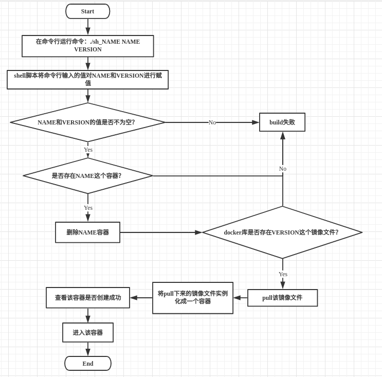

- [什么是shell](#什么是shell)
- [常见的shell](#常见的shell)
- [Linux下shell的基本知识](#linux下shell的基本知识)
- [进入shell的方法](#进入shell的方法)
    - [Linux控制台](#linux控制台)
    - [终端（Terminal）](#终端terminal)
- [培训目的](#培训目的)
- [shell命令模块](#shell命令模块)
    - [`#! /bin/bash`的作用](#-binbash的作用)
    - [运行shell的方法](#运行shell的方法)
        - [方式一：赋予相应文件执行(x)权限](#方式一赋予相应文件执行x权限)
        - [方式二：作为解释器参数运行](#方式二作为解释器参数运行)
    - [shell变量事项](#shell变量事项)
        - [变量命名规则](#变量命名规则)
        - [变量与赋值之间的规则](#变量与赋值之间的规则)
        - [变量的使用](#变量的使用)
        - [变量的操作](#变量的操作)
    - [Shell字符串](#shell字符串)
        - [单引号](#单引号)
        - [双引号](#双引号)
        - [字符串拼接](#字符串拼接)
        - [字符串的相关操作](#字符串的相关操作)
    - [Shell数组](#shell数组)
        - [定义数组](#定义数组)
        - [读取数组](#读取数组)
        - [获取数组的长度](#获取数组的长度)
    - [Shell注释](#shell注释)
    - [Shell参数传递](#shell参数传递)
    - [Shell基本运算符](#shell基本运算符)
        - [Shell算术运算符](#shell算术运算符)
        - [Shell关系运算符(仅比较数字)](#shell关系运算符仅比较数字)
        - [Shell布尔运算符(bool)](#shell布尔运算符bool)
        - [Shell逻辑运算符](#shell逻辑运算符)
        - [Shell字符串运算符](#shell字符串运算符)
        - [Shell文件测试运算符](#shell文件测试运算符)
    - [Shell read命令](#shell-read命令)
    - [Shell echo命令](#shell-echo命令)
    - [Shell printf命令](#shell-printf命令)
    - [Shell test命令](#shell-test命令)
    - [Shell的流程控制](#shell的流程控制)
        - [if判断语句](#if判断语句)
        - [for循环语句](#for循环语句)
        - [while循环语句](#while循环语句)
        - [for 和 while 的无限循环体系](#for-和-while-的无限循环体系)
        - [until循环](#until循环)
        - [case多选择语句](#case多选择语句)
        - [Shell 函数](#shell-函数)
    - [研究向](#研究向)
        - [关于`$?`的研究](#关于的研究)
        - [待续...](#待续)
- [测试服务器的脚本实例讲解](#测试服务器的脚本实例讲解)
    - [我们build都是在干嘛？](#我们build都是在干嘛)
    - [为什么每次build都需要传递参数？](#为什么每次build都需要传递参数)
    - [一个完整的shell脚本运行流程是怎样的？](#一个完整的shell脚本运行流程是怎样的)

&lt;!-- /TOC --&gt;

## 什么是shell

1. shell相当于是一个中介、一个用户与linux内核的一个接口
2. 用户通过对shell执行一些命令来操作linux内核
3. shell是一个应用程序，但拥有自己的语言，而且是一个脚本语言(解释型语言)
4. shell script =&gt; shell脚本

## 常见的shell

- 最为常见的两种
  - sh
    - sh的全称是`Bourne shell`
  - bash
    - `bash shell`是Linux的默认shell
    - 保持了对`sh shell`的兼容性，是各种Linux发行版默认配置的shell。
    - `bash`兼容`sh`，完成兼容`ash`
    - `bash`和`sh`的不同之处：
      - 一方面，`bash`扩展了一些命令和参数；
      - 另一方面，`bash`并不完全和`sh`兼容，它们有些行为并不一致，但在大多数企业运维的情况下区别不大，特殊场景可以使用`bash`代替`sh`。

- 还有以下多种不同的shell(`csh`、`tcsh`、`ash`...)，都是历变过程，有兴趣可以去了解以下。

## Linux下shell的基本知识

1. shell是一个程序，一般放在`/bin`或者`/usr/bin`下
2. Linux系统的可用shell被记录在`/etc/shells`中 =&gt; `cat /etc/shells`可以查看可用shell
3. 可以通过`echo $SHELL`在查看当前linux的默认shell

## 进入shell的方法

### Linux控制台

1. 一般而言，linux系统分为控制台模式与图形界面模式
2. 如何直接进入控制台模式：`Ctrl + Alt + Fn(n=1,2,3,4,5...)`
3. 关于不同的linux系统的差异
   1. CentOS
      - CentOS在启动时会创建6个虚拟控制台
      - 使用`Ctrl + Alt + Fn(n=2,3,4,5,6)`可以切换为不同的虚拟控制台
      - 使用`Ctrl + Alt + F1`可以切换为图形界面模式，也就是说1号控制台被图形桌面程序占用了
   1. Ubuntu
      - Ubuntu在启动时会创建7个虚拟控制台
      - 使用`Ctrl + Alt + Fn(n=1,2,3,4,5,6)`可以切换为不同的虚拟控制台
      - 使用`Ctrl + Alt + F7`可以切换为图形界面模式
      - 重启桌面命令：```sudo service lightdm restart```

4. 进入控制台后可以直接输入shell命令进行操作

### 终端（Terminal）

- 相关快捷键
  - `Ctrl + Alt + T`：打开一个新的终端
  - `Ctrl + Shift + T`：在已有的终端上打开一个Tab
  - `Ctrl + Shift + N`：当前窗口为终端界面时，打开一个新的终端
  - `Ctrl + Shift + W`：关闭当前的Tab，ubuntu下可以关闭最后一个Tab
  - `Ctrl + D`：关闭当前的Tab，如果只有一个Tab就关闭该Tab
  - `Ctrl + Shift + Q`：关闭当前的终端，包括所有的Tab

## 培训目的

- 帮助大家在进行测试时，能够更好的看懂开发提供的相关资料
- 可以让我们在build的时候不再是一味的运行命令，而是能清楚的了解我们到底在干些什么

## shell命令模块

### `#! /bin/bash`的作用

- `#!`是一个约定标记，用于告诉系统使用什么方式来运行
- `/bin/bash`就是告诉系统使用bash来运行这个脚本
- 例：#!/usr/bin/env python
  - 告诉系统使用/usr/bin下的python来执行这个文件
  - **`env`的作用：如果/usr/bin下面没有python，则在系统中找到python的路径在执行**

### 运行shell的方法

#### 方式一：赋予相应文件执行(x)权限

1. `chmod +x ${file_name}`
2. `./${file_name}`

#### 方式二：作为解释器参数运行

- `/bin/bash ${file_name}`
- `/bin/sh ${file_name}`
- 注释：使用这种方法进行文件运行时，可以不需要在文件的首行添加`#!`进行约定

### shell变量事项

#### 变量命名规则

1. 变量中只能包含：数字、字母和下划线
2. 变量不能以数字开头
3. 不能使用bash、sh中的关键字

#### 变量与赋值之间的规则

- 等号的两端不能有空格
  - 正确用法：name=value
  - 错误用法：name= value、name =value、name = value。

&lt;!-- #### 关于变量赋值的方法

1. 直接赋值：`variable=&#39;hello world!&#39;`

1. `for语句`赋值 =&gt; for 变量名 in 取值内容/取值范围

   - 实例：
   
    ``` bash
    for file in `ls ./`
    ```

   - `for file in $(ls ./)`
   - 两者作用一致 --&gt;

#### 变量的使用

- 变量的使用有两个方法
  - `$variable`
  - `${variable}`

- 两者的区别在于花括号用于确认变量的边界，如：`${MY}name`
  - 这种情况下，`MY`为变量，`name`只是普通字符串

#### 变量的操作

- 只读变量
  - `readonly + variable`：设置为只读变量
  
  ```bash
  readonly my_name
  echo ${my_name}
  my_name=&quot;Mxiobai&quot;
  ```
  
  - 以上代码`my_name`输出为空，进行赋值时，会提醒为只读变量

- 删除变量
  - `unset + varibale`：删除变量，但实际作用类似于清空，而不是删除，且无法删除`readonly variable`(只读变量)
  
    ```bash
    #! /bin/bash
    my_name=&quot;Mxiobai&quot;
    echo ${my_name}
    unset my_name
    echo ${my_name}
    ```
  
  - 第一个echo正常输出，第二个输出为空

&lt;!-- #### 变量类型

- 局部变量：仅在当前shell中起作用
- 环境变量：所有的程序，包括已经启动的shell script都能调用这个变量；必要时shell也能定义全局变量
- shell变量：由shell程序设置的特殊变量。可以是环境变量，也可以是全局变量 --&gt;

### Shell字符串

#### 单引号

- 单引号里的任何字符都能原样输出
- 单引号中无法引用变量，如：`&#39;hello, welcome to ${my_world}!&#39;`，这里的`${my_world}`只是一个字符串
- 单引号不能单独出现，必须成对出现
- 单引号中转义字符(`\`)无效

#### 双引号

- 双引号中所有变量可用
- 双引号中能出现转义字符
- 双引号必须成对出现
- 实例：`&quot;hello， welcome to ${my_world}! \n&quot;`

#### 字符串拼接

```bash
#! /bin/bash
my_name=&#39;Mxiobai&#39;
# 双引号拼接
greeting_0=&quot;hello, &quot;$my_name&quot; !&quot;
greeting_1=&quot;hello, ${my_name} !&quot;
echo $greeting_0 $greeting_1 =&gt; hello, Mxiobai ! hello, Mxiobai !

# 单引号拼接
greeting_2=&#39;hello, &#39;$my_name&#39; !&#39;
greeting_3=&#39;hello, ${my_name} !&#39;
echo $greeting_2 $greeting_3 =&gt; hello, Mxiobai ! hello, ${my_name} !

# 单双同时存在
greeting_4=&quot;hello, &#39;${my_name}&#39; !&quot;
greeting_5=&#39;hello, &quot;${my_name}&quot; !&#39;
echo $greeting_4 $greeting_5 =&gt; hello, &#39;Mxiobai&#39; ! hello, &quot;${my_name}&quot;
```

#### 字符串的相关操作

- 使用变量：`name=&quot;Mxiobai&quot;`
- 获取字符串长度：`echo ${#name}` =&gt; 7
- 提取子字符串：`echo ${name:0:4}` =&gt; Mxio
  - 分片操作，从0开始算起，不会取最大边界值，在这里就是4

- 查找子字符串：```echo `expr index &quot;$name&quot; io` ``` =&gt; ~~2~~ `3`
  - 解释：该条命令会在`name`这个变量中找`i`或`o`这两字母的位置，会先检索一次两个字母，无论谁在前后，都会输出name这个变量中先出现字母的位置，以1开始算起，找不到则输出0
  - 例：```echo `expr index &quot;$name&quot; iaboixM` ``` =&gt; 1

- 以上所有操作输出的结果都可以当成一个值，且可以赋值给其他变量

### Shell数组

#### 定义数组

- 定义数组存在三种方法：
  - 方法一：`array_name=(value0 value1 ... valuen)`
  - 方法二：

    ```bash
    array_name=(
        value0
        value1
        ...
        valuen
    )
    ```

  - 方法三：

    ```bash
    array_name[0]=value0
    array_name[1]=value1
    ...
    array_name[n]=valuen
    ```

#### 读取数组

- `${array_name[index]}` =&gt; 正常的读取方法，index表示索引，默认从0开始算起
- `${array_name[n+1]}` =&gt; 输出为空，n表示最大索引值
- `${array_name[]}` =&gt; 报错
- `${array_name}` =&gt; 默认输出第一个元素，也就是index=0的值

- `$array_name[*]`和`${array_name[@]}` =&gt; 输出所有元素
- `$array_name[index]` =&gt; 输出第一个元素后面接`[index]`，就是说读取数组必须加花括号
  - `$array_name[0]` =&gt; value0[0]

#### 获取数组的长度

- `${#array_name[index]}` =&gt; 正常的读取方法
- `${#array_name[@]}`和`${#array_name[*]}` =&gt; 输出当前数组中元素的个数
- `${#array_name[n]}` =&gt; 输出第n个元素的长度

### Shell注释

- 单行注释：`#`，在使用时，最好在`#`后面接个空格
- 多行注释：
  - 方法一：
  
  ```bash
  :&lt;&lt;EOF
  注释内容...
  注释内容...
  注释内容...
  EOF
  ```

  - 方法二：
  
  ```bash
  :&lt;&lt;&#39;
  注释内容...
  注释内容...
  注释内容...
  &#39;
  ```

  - 方法三：
  
  ```bash
  :&lt;&lt;!
  注释内容...
  注释内容...
  注释内容...
  !
  ```

### Shell参数传递

- 脚本内获取参数的格式：`$n`
  - 实例与说明
    - 实例：`./test.sh 1 2 3 4 5 6 7 8 9 12`
      - `$0` =&gt; ./test.sh
      - `$1` =&gt; 1
      - `$2` =&gt; 2
      - `$3` =&gt; 3
      - `$10` =&gt; 10
      - `${10}` =&gt; 12

    - 说明：`$`后面加数字，表示读取传入的第几个参数，具体实例可以参考[为什么每次build都需要传递参数？](https://g5.iot-sw.net:2443/company/university/quality/Test_Case/issues/360#%E4%B8%BA%E4%BB%80%E4%B9%88%E6%AF%8F%E6%AC%A1build%E9%83%BD%E9%9C%80%E8%A6%81%E4%BC%A0%E9%80%92%E5%8F%82%E6%95%B0)

- 处理参数的特殊字符：
&lt;!-- --&gt;

| 参数处理 | 说明 |
| :----: | :--- |
| $# | 计算传递到脚本的参数个数(不会将脚本本身计算在内) |
| $* | 将所有参数以一个字符串的形式进行表示，所有参数以空格隔开 |
| $@ | 与$*作用一致  &lt;br&gt;唯一区别：加上双引号时，可以使用for对每个元素进行遍历   |
| $$ | 脚本运行的当前进程的PID号 |
| $! | 后台运行的最后一个进程的PID号 |
| $- | 显示shell使用的当前状态 |
| $? | 显示最后命令的退出状态。0表示没有错误，其他任何数值都表示有错误(部分函数除外) |
| ${n} | 当`n &gt;= 10`时，\$n已经无法正常读取到参数，因此需要使用\${n}来获取参数内容 |

### Shell基本运算符

#### Shell算术运算符

| 运算符 | 说明 | 用法举例 |
| :---: | :-- | :-- |
| + | 加法运算 | ``` `expr $a + $b` ``` |
| - | 减法运算 | ``` `expr $a - $b` ``` |
| * | 乘法运算，必须在乘号前加`\` | ``` `expr $a \* $b` ``` |
| / | 除法运算 | ``` `expr $a / $b` ``` |
| % | 取余 | ``` `expr $a % $b` ``` |
| = | 赋值 | `a=$b` |
| == | 判断是否相等，数字和字符串之间并没有差别 | `[ $a == $b ]` =&gt; 同true异false |
| != | 判断是否不相等 | `[ $a != $b ]` =&gt; 异true同false |

#### Shell关系运算符(仅比较数字)

| 运算符 | 说明 | 用法举例 |
| :---- | :-- | :-- |
| -eq =&gt; equal | 判断两者是否相等(==) | `[ $a -eq $b ]` |
| -ne =&gt; not equal | 判断两者是否不相等(!=) | `[ $a -ne $b ]` |
| -gt =&gt; greater than | 判断左边是否大于右边(&gt;) | `[ $a -gt $b ]` |
| -lt =&gt; less than | 判断左边是否小于右边(&lt;) | `[ $a -lt $b ]` |
| -ge =&gt; greater than or equal | 判断左边是否大于等于右边(&gt;=) | `[ $a -ge $b ]` |
| -le =&gt; less than or equal | 判断左边是否小于等于右边(&lt;=) | `[ $a -le $b ]` |

#### Shell布尔运算符(bool)

| 运算符 | 说明 | 用法举例 |
| :---: | :-- | :-- |
| -a | 与运算 | `[ $a -le 20 -a $b -ge 100 ]` |
| -o | 或运算 | `[ $a -lt 20 -o $b -ge 100 ]` |
| ! | 非运算 | `[ ! false ]` or `[ ! $a -ge $b ]` |

#### Shell逻辑运算符

| 运算符 | 说明 | 用法举例 |
| :---: | :-- | :--- |
| &amp;&amp; | 逻辑与(and) | `[[ $a -le 20 &amp;&amp; $b -ge 100 ]]` |
| `||` | 逻辑或(or) | `[[ $a -le 20 || $b -ge 100 ]]` |

- 说明=&gt;由于逻辑运算符在运行时可能出现问题，因此在使用时最好使用双中括号`[[  ]]`

#### Shell字符串运算符

| 运算符 | 说明 | 用法举例 |
| :---: | :-- | :--- |
| = | 判断两个字符串是否相等 | `[ $a = $b ]` |
| != | 判断两个字符串是否不相等 | `[ $a != $b ]` |
| -z | 判断字符串的长度是否为零 | `[ -z $a ]` |
| -n | 判断字符串的长度是否不为零 | `[ -n &quot;$a&quot; ]`/`[ -n $a ]` |
| $ | 判断字符串是否不为空，相当于判断变量是否存在 | `[ $a ]` |

#### Shell文件测试运算符

- file=&gt;文件的绝对路径+文件名

| 运算符 | 说明 | 用法举例 |
| :---: | :-- | :--- |
| -r file | 判断文件是否为可读文件 | `[ -r $file ]` |
| -w file | 判断文件是否为可写文件 | `[ -w $file ]` |
| -x file | 判断文件是否为可执行文件 | `[ -x $file ]` |
| -e file | 判断是否or目录是否存在 | `[ -e $file ]` |
| -d file | 判断文件是否为目录 | `[ -d $file ]` |
| -f file | 判断文件是否为普通文件 | `[ -f $file ]` |
| -s file | 判断文件是否不为空(文件大小大于0) | `[ -s $file ]` |
| -b file | 判断文件是否为块设备文件 | `[ -b $file ]` |
| -c file | 判断文件是否为字符设备文件 | `[ -c $file ]` |
| -g file | 判断文件是否设置了SGID位 | `[ -g $file ]` |
| -k file | 判断文件是否设置了粘着位(Sticky Bit) | `[ -k $file ]` |
| -p file | 判断文件是否是有名管道 | `[ -p $file ]` |
| -u file | 判断文件是否设置了SUID位 | `[ -u $file ]` |

### Shell read命令

- 读取键盘输入的参数，以空格作为分隔符
- read允许同时传递多个参数，如：`read firstStr secondStr`，传参时每个参数之间用空格隔开
- 实例

    ```bash
    #! /bin/bash

    read firstStr secondStr
    echo &quot;firstStr is ${firstStr}&quot;
    echo &quot;secondStr is ${secondStr}&quot;

    传入参数=&gt;1 2 3 4
    结果=&gt;firstStr is 1
         secondStr is 2 3 4
    ```

- read参数介绍
  - `-p`：输入提醒字段，后面加不加引号都可以，但是如果存在空格，就必须加引号
  - `-n`：输入字符时长度限制，只可以小于，超过后自动结束
  - `-t`：输入限时，单位为秒(s)
  - `-s`：隐藏输入内容
  - 实例：

    ```bash
    read -p &quot;please enter your password&quot; -n 10 -t 5 -s password
    echo $password
    ```

### Shell echo命令

- 显示普通字符串
  - `echo &quot;It is a test.&quot;` =&gt; 双引号
  - `echo &#39;It is a test.&#39;` =&gt; 单引号
  - `echo It is a test.` =&gt; 不加引号
  - 三种方式都能够正常打印

- 显示转义字符
  - `echo &quot;\&quot;It is a test.\&quot;&quot;` =&gt; &quot;It is a test.&quot;
  - `echo &#39;&quot;It is a test.&quot;&#39;` =&gt; &quot;It is a test.&quot;
  - `echo \&quot;It is a test.\&quot;` =&gt; &quot;It is a test.&quot;
  - `echo &quot;&#39;It is a test.&#39;&quot;` =&gt; &#39;It is a test.&#39;

- 显示变量
  - 控制台输入变量：`read name` =&gt; name表示变量名
  - `echo $name is me.` =&gt; Mxio is me.

- 开启转义模式
  - `echo -e &quot;O\tK!&quot;` =&gt; O       K!
  - `echo -e &quot;O\nK!&quot;` =&gt; O 换行 K!
  - `echo -e &quot;OK! \c&quot;` =&gt; OK！ 不换行后面直接显示下一条命令

    ```bash
    echo -e &quot;OK! \c&quot;
    echo &quot;Let me go!&quot; =&gt; OK! Let me go!
    ```

- 将结果定向到文件
  
- `echo &quot;Holle World!&quot; &gt; frist.txt` =&gt; 会将`Hello World!`编写在文件`frist.txt`中
  
- 显示日期
  - ```echo `date` ``` =&gt; 显示当前日期
  - 这个日期无法使用算术运算符进行运算

### Shell printf命令

- `printf format-string [arguments...]`
  - format-string =&gt; 格式化控制字符，如：%d、%s、%f
  - arguments =&gt; 参数列表
  - printf 默认不换行打印
  - printf 需要展示的内容需要以空格隔开，具体的展示效果以format-string为准

    ```bash
    printf &quot;%-10s%-8s%-4.2f\n&quot; Mxio Bai 04.10
    ```

  - 解析
    - %s =&gt; 字符串、%d =&gt; 整型、%m.nf =&gt; 浮点型
    - `-`表示左对齐，没有默认右对齐
      - `%-10s` =&gt; 表示内容向左对齐，只展示10个内容，不足以空格补充，超过则裁剪

    - `m`表示最小数值数
    - `.n`表示小数点后保留几位，不足以0补齐，超过则四舍五入

  - 实例：

    ```bash
    printf &quot;%-10s%-8s%-4s\n&quot; name sex weight
    printf &quot;%-10s%-8s%-4.2f\n&quot; Mxio boy 66.1234
    printf &quot;%-10s%-8s%-4.2f\n&quot; Bai boy 48.6549
    printf &quot;%-10s%-8s%-4.2f\n&quot; milly girl 45.9562
    ```

    ```bash
    #! /bin/bash

    printf &quot;%d %s\n&quot; 1 &quot;abc&quot; =&gt; 1 abc

    printf &#39;%d %s\n&#39; 1 &quot;abc&quot; =&gt; 1 abc

    printf %s abcdef =&gt; abcdef

    printf %s abc def =&gt; abcdef

    printf &quot;%s\n&quot; abc def =&gt; abc
                             def

    printf &quot;%s %s %s\n&quot; a b c d e f g h i j =&gt; a b c
                                               d e f
                                               g h i
                                               j

    printf &quot;%s、%d and %f\n&quot; =&gt;  、0 and 0.000000
    ```

### Shell test命令

- 作用类似与`[]`，一般放在if语句中使用
  
- `[]`的特殊用法 =&gt; `a=$[2+3] =&gt; echo $a =&gt; 5`
  
- 可以进行数值、字符和文件三个方面的测试
- 实例：

  ```bash
  a=500
  b=20
  if test $a -eq $b
  then
      echo &#39;a==b&#39;
  else
      echo &#39;a!=b&#39;
  fi
  ```

### Shell的流程控制

#### if判断语句

- 注意事项：在某些开发语言中if-else的else下是可以不填加任何信息的，但是sh/bash不行，else处必须有命令语句，如果没有的话就不用添加

    ```bash
    if condition1
    then
        command1
    elif condition2
    then
        command2
    elif condition3
    then
        command3
    ...
    else
        commandN
    fi
    ```

- 实例：

    ```bash
    #! /bin/bash

    a=$1
    b=$2

    if [ &quot;$a&quot; == &quot;&quot; -o &quot;$b&quot; == &quot;&quot; ]
    then
        echo &quot;输入值为空&quot;
        exit
    fi

    if test $a -eq $b
    then
        echo &quot;a==b&quot;
    elif test $a -gt $b
    then
        echo &quot;a&gt;b&quot;
    elif test $a -lt $b
    then
        echo &quot;a&lt;b&quot;
    else
        echo &#39;无法比较&#39;
    fi
    ```

#### for循环语句

- 使用方法有两种，如下所示：

    ```bash
    for var in item1 item2...itemN
    do
        command1
        command2
        ...
        commandN
    done
    ```

    ```bash
    for ((assignment; condition; next))
    do
        command1
        command2
        ...
        commandN
    done
    ```

- 实例

    ```bash
    #! /bin/bash

    for loop in 0 1 2 3 4
    do
        echo &quot;Now, the value of loop is ${loop}&quot;
    done

    for ((loop=0; loop&lt;5; loop++))
    do
        echo &quot;Now, the value of loop is ${loop}&quot;
    done
    ```

#### while循环语句

- 扩展知识：linux 的`let`命令
  - let arg[ arg ...] =&gt; 用于执行一个或多个表达式，是linux自带的一个计算工具
    - 注意：如果表达式中存在空格或者特殊字符，则需要使用引号将内容进行包裹，单双都行，并且不需要使用`$`表示变量
    - 实例=&gt; `let a++`、`let a--`、`let a+=10`、`let a-=10`

- 语法

    ```bash
    while condition
    do
        command1
        command2
        ...
        commandN
    done
    ```

- 实例

    ```bash
    #！ /bin/bash

    a=0
    while (($a&lt;5))
    do
        echo $a
        let a++
    done

    while read -p &quot;请输入你的名字：&quot; name
    do
        echo &quot;OH! $name is a good name!&quot;
    done
    ```

- 注意事项：
  - `while (())`括号里面的变量要用`$`表示
  - 可以使用`Ctrl+D`退出while循环

#### for 和 while 的无限循环体系

```bash
while :
do
    command
done
```

```bash
while true
do
    command
done
```

```bash
for (( ; ; ))
do
    command
done
```

#### until循环

- until循环在逻辑处理上与while循环相反，until循环为不满足条件继续循环，直到满足为止
- 语法

    ```bash
    until condition
    do
        command
    done
    ```

- 实例：

    ```bash
    #! /bin/bash

    a=0
    until [ ! $a -lt 5 ]
    do
        echo $a
        # a=`expr $a + 1`
        let a++
    done
    ```

#### case多选择语句

- 可以用case语句匹配一个值与一个模式，如果匹配成功，则会执行相应的模式
- 模式的执行顺序时从下往上执行，满足一次匹配就不会在匹配第二次了

    ```bash
    case 值 in
        模式1)
            command
        ;;
        模式2)
            command
        ;;
        ...
        模式N)
            command
        ;;
    esac
    ```

- 实例

    ```bash
    #! /bin/bash

    read -p &quot;请输入1～4之中的一个整数：&quot; num
    case $num in
        1)
            echo &quot;你输入的数是 1 &quot;
        ;;
        2)
            echo &quot;你输入的数是 2 &quot;
        ;;
        3)
            echo &quot;你输入的数是 3 &quot;
        ;;
        4)
            echo &quot;你输入的数是 4 &quot;
        ;;
        *)
            echo &quot;你的输入有误&quot;
        ;;
    esac
    ```

- 进阶

    ```bash
    #! /bin/bash

    while read -p &quot;请输入一个1～4之间的整数：&quot; num
    do
        case $num in
            1|2|3|4)
                echo &quot;你输入的数是 $num&quot;
            ;;
            q)
                echo &quot;程序已退出&quot;
                break
            ;;
            *)
                echo &quot;你的输入有误！请重新输入&quot;
            ;;
        esac
    done
    ```

#### Shell 函数

- 语法

    ```bash
    [function ]funname[()]
    {
        action;
        [return int;]
    }
    ```

- 说明
  1. 可以使用`function fun()`定义函数，也可以直接用fun()定义
  2. 可以使用return 返回；如果不加的话，默认以最后一条命令作为运行结果，一般而言，如果运行成功返回值为0，为其他数值时表示错误。
  3. 引用函数时，千万不要加括号 =&gt; `fun() 1 2 3`，会报错

  ```bash
  demoFun(){
      echo &quot;My frist Fun()!&quot;
  }

  echo &quot;函数开始执行...&quot;
  demoFun
  echo $?
  echo &quot;函数执行结束...&quot;
  ```

- 如何在函数中传递参数

  ```bash
  demoFun(){
      echo $1
      echo $#
  }

  demoFun 1 2 3 =&gt; 1 3
  ```

### 研究向
#### 关于`$?`的研究
- `$?`返回最后一条命令的运行状态，为0表示正常运行，其他任何数据则表示运行错误(函数的`return`除外)
- 这个研究产生的原因
  - 带有return的函数和python中不一样，无法当作一个值来使用，因此如果获取return的值成了问题

- 因此我们可以使用`$?`来获取函数的return值，将这个值赋值给一个变量
  - 注意：必须紧跟着调用函数语句

#### 待续...

## 测试服务器的脚本实例讲解

### 我们build都是在干嘛？

- 测试人员接手到一个新项目后，一开始做的都是了解项目的相关需求以及功能点、模块，然后自己进行总结归纳，完成测试用例的编写。
- 完成第一个步骤之后，就会出现两个新的东西：build申请和测试申请，那么这两个东西都是什么呢？

  - build申请和测试申请都是由开发人员进行提交，不论内容而言，唯一的不同就是指派人员，build申请是给stephen的，而测试申请是给我们测试人员的，这就说明，一个是需要技术人员支持，另一个就是告诉我们可以测试了。
  - 实际上的区别是什么呢？

    - 之所以build申请在前，是因为我们需要stephen将开发push到gitlab上的代码以及相关环境进行docker打包，打包完成之后再由stephen上传到镜像服务器中；
    - 上传到镜像服务器了之后，stephen给出的`build tag`、`image name`以及`image id`实际上就是帮助我们去镜像服务器里面拿东西的方向标。
    - 这也解释了为什么测试申请在后，以及我们build都是在干啥了：**我们build其实就是通过shell脚本从镜像服务器中将相关项目的docker拿下来，在测试服务器上搭建这个项目的环境以及进行代码更新。**

### 为什么每次build都需要传递参数？

- 我们每次build时，都需要在运行脚本的同时将`容器名`和测试申请中的(stephen提供的)`build tag`作为参数进行传递，而且传递的顺序还不能变，不然会build失败，这是为什么呢？

  - 这是因为我们所运行`.sh`文件，开头有这么三行代码

    ```bash
    NAME=$1
    VERSION=$2

    IMAGE_NAME=&#39;registry.iot-sw.net:5443/company/cloudpark-official-website-sit&#39;
    ```

    - 这三行代码在shell中表示变量赋值的意思，`NAME=$1`、`VERSION=$2`就是告诉我们它获取的值分别时你传入的`容器名`和`build tag`，第三个`IMAGE_NAME=***`就是给固定值的赋值方法。(注意：如果要改动变量的值，前往不要在等号的任意一端加空格，否则会报错。)
    - 如果第三个变成了`IMAGE_NAME=$3`就意味着你在传参的时候，需要将测试申请中的`image name`加在最后面传进来

  - 紧随其后的是一个if判断语句

    ```bash
    if [ &quot;${NAME}&quot; == &quot;&quot; -o &quot;${VERSION}&quot; == &quot;&quot; ]; then
        echo &quot;Usage: $0 container-name image-version&quot;
        echo &quot;&quot;
        exit
    fi
    ```

    - 这个判断语句告诉我们，如果`NAME`和`VERSION`这两个变量任一一个而空，都会直接停止本次脚本的执行，这也就是为什么不传参数，或者少传了参数会build失败的原因

  - 再之后就是一段这样的代码

    ```bash
    echo &quot;#############容器正常删除#############&quot;
    docker rm -f ${NAME}

    ############重新pull镜像文件################
    docker pull ${IMAGE_NAME}:${VERSION}
    ```

    - 这段代码告诉我们参数不能传递错误，否则将报错
    - 也正是因为有`docker rm -f ${NAME}`这一句存在，因此你在第一次build失败后，重新在运行一次时，会告诉你没有容器可以删除，所以遇到了不要怕，这是正常现象
    - 还有一种情况也会导致失败，是因为`docker pull ${IMAGE_NAME}:${VERSION}`的存在，导致这个原因的一般有三个：
      1. 你自己传参的时候的时候`build tag`写错了
      1. 开发给你的测试申请中的`build tag`给错了
      1. 测试服务器没有访问这个镜像服务器的权限，或者说还没有上传到镜像服务器中

---

### 一个完整的shell脚本运行流程是怎样的？

- 讲了这么多，我们来介绍一下你在命令行输入的那个命令到底都做了些什么

   
